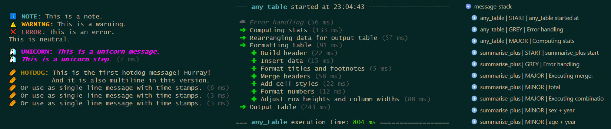

<!-- README.md is generated from README.Rmd. Please edit that file -->

```{r, include = FALSE}
knitr::opts_chunk$set(
  collapse = TRUE,
  comment = "#>",
  fig.path = "man/figures/README-",
  out.width = "100%"
)
```

# printify 

<!-- badges: start -->
[](https://cran.r-project.org/package=printify)
[](https://github.com/s3rdia/printify)
[](https://cran.r-project.org/web/checks/check_results_printify.html)
[](https://deepwiki.com/s3rdia/printify)
[](https://s3rdia.github.io/qol_blog/)
[](https://CRAN.R-project.org/package=printify)
<!-- badges: end -->

Custom Formatted Console Messages With Timing Support

A lightweight message system relying purely on base R. Comes with built-in and pre styled message types and provides an easy way to create custom messages. Supports individually styled and colored text as well as timing information. Designed to make console output more informative and visually organized.

## Installation

```{r install, eval = FALSE}
# Official release
install.packages("printify")

# Development version
devtools::install_github("s3rdia/printify")

install.packages('printify', repos = c('https://s3rdia.r-universe.dev', 'https://cloud.r-project.org'))

pak::pak("s3rdia/printify")
```

## Styled messages



```{r messages, eval = FALSE}
library(printify)

# Example messages
print_message("NOTE", c("Just a quick note that you can also insert e.g.[? a / ]variable",
                        "name[?s] like this: [listing].",
                        "Depending on the number of variables you can also alter the text."),
             listing = c("age", "state", "NUTS3"))

print_message("WARNING", "Just a quick [#FF00FF colored warning]!")

print_message("ERROR", "Or a [b]bold[/b], [i]italic[/i] and [u]underlined[/u] error.")

print_message("NEUTRAL", c("You can also just output [u]plain text[/u] if you like and use",
                           "[#FFFF00 [b]all the different[/b] [i]formatting options.[/i]]"))

# Different headlines
print_headline("This is a headline")

print_headline("[#00FFFF This is a different headline] with some color",
               line_char = "-")

print_headline("[b]This is a very small[/b] and bold headline",
               line_char = ".",
               max_width = 60)

# Messages with time stamps
test_func <- function(){
    print_start_message()
    print_step("GREY", "Probably not so important")
    print_step("MAJOR", "This is a major step...")
    print_step("MINOR", "Sub step1")
    print_step("MINOR", "Sub step2")
    print_step("MINOR", "Sub step3")
    print_step("MAJOR", "[b]Finishing... [/b][#00FFFF with some color again!]")
    print_closing()
}

test_func()

# See what is going on in the message stack
message_stack <- get_message_stack()

# Set up a custom message
set_up_custom_message(type           = "HOTDOG",
                      color          = "#B27A01",
                      ansi_icon      = "\U0001f32d",
                      text_icon      = "IOI",
                      indent         = 1,
                      ansi_wait_icon = "\U00023f1",
                      text_wait_icon = "/",)

hotdog_print <- function(){
    print_start_message()
    print_message("HOTDOG", c("This is the first hotdog message! Hurray!",
                              "And it is also multiline in this version."))
    print_step("HOTDOG", "Or use as single line message with time stamps.")
    Sys.sleep(0.5)
    print_step("HOTDOG", "Or use as single line message with time stamps.")
    Sys.sleep(0.5)
    print_step("HOTDOG", "Or use as single line message with time stamps.")
    Sys.sleep(0.5)
    print_closing()
}

hotdog_print()

# See new message in the message stack
hotdog_stack <- get_message_stack()
```


## Check out the big brother

The message system originated in the package [qol](https://github.com/s3rdia/qol).
