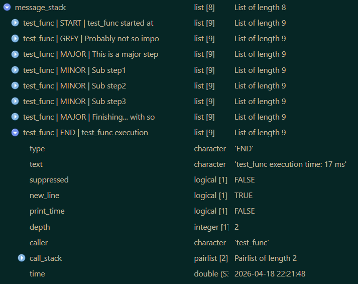

# printify

Custom Formatted Console Messages With Timing Support

A lightweight message system relying purely on base R. Comes with
built-in and pre styled message types and provides an easy way to create
custom messages. Supports individually styled and colored text as well
as timing information. Designed to make console output more informative
and visually organized.

## Installation

``` r
# Official release
install.packages("printify")

# Development version
devtools::install_github("s3rdia/printify")

install.packages('printify', repos = c('https://s3rdia.r-universe.dev', 'https://cloud.r-project.org'))

pak::pak("s3rdia/printify")
```

## Styled messages

The functions in this package actually talk to the user and show what
they are doing during runtime. The message system relies on pure base R
and does not only provide built in message types, but also custom ones.


``` r
library(printify)

# Example messages
print_message("NOTE", c("Just a quick note that you can also insert e.g.[? a / ]variable",
                        "name[?s] like this: [listing].",
                        "Depending on the number of variables you can also alter the text."),
             listing = c("age", "state", "NUTS3"))
             
#> [1m[38;5;73m ℹ️ NOTE: [0mJust a quick note that you can also insert e.g. variable
#> [1m[38;5;73m ℹ️       [0mnames like this: age, state, NUTS3.
#> [1m[38;5;73m ℹ️       [0mDepending on the number of variables you can also alter the text.

print_message("WARNING", "Just a quick [#FF00FF colored warning]!")

#> [1m[38;5;214m ⚠️ WARNING: [0mJust a quick [38;5;201mcolored warning[0m[0m!

print_message("ERROR", "Or a [b]bold[/b], [i]italic[/i] and [u]underlined[/u] error.")

#> [1m[38;5;131m ❌ ERROR: [0mOr a [1mbold[22m, [3mitalic[23m and [4munderlined[24m error.

print_message("NEUTRAL", c("You can also just output [u]plain text[/u] if you like and use",
                           "[#FFFF00 [b]all the different[/b] [i]formatting options.[/i]]"))
                           
#> [1m[38;5;73m [0mYou can also just output [4mplain text[24m if you like and use
#> [1m[38;5;73m [0m[38;5;226m[1mall the different[22m [3mformatting options.[23m[0m[0m

# Different headlines
print_headline("This is a headline")

#> 
#> === This is a headline =========================================================

print_headline("[#00FFFF This is a different headline] with some color",
               line_char = "-")
               
#> 
#> --- [38;5;51mThis is a different headline[0m[0m with some color -------------------------------

print_headline("[b]This is a very small[/b] and bold headline",
               line_char = ".",
               max_width = 60)
               
#> 
#> ... [1mThis is a very small[22m and bold headline .................

# Messages with time stamps
test_func <- function(){
    print_start_message()
    print_step("GREY", "Probably not so important")
    print_step("MAJOR", "This is a major step...")
    print_step("MINOR", "Sub step1")
    print_step("MINOR", "Sub step2")
    print_step("MINOR", "Sub step3")
    print_step("MAJOR", "[b]Finishing... [/b][#00FFFF with some color again!]")
    print_closing()
}

test_func()

#> 
#> === [1m[38;5;73mtest_func[0m[0m[22m started at 22:11:58 ==============================================
#> 
#> [1m[38;5;59m ☁ [0m[3m[38;5;59mProbably not so important[0m[0m[23m[1m[38;5;59m ☁ [0m[3m[38;5;59mProbably not so important[0m[0m[23m [38;5;59m(26 ms)[0m[0m
#> [1m[38;5;40m ➔ [0mThis is a major step... [38;5;59m(13 ms)[0m[0m
#> [1m[38;5;40m    ✚ [0mSub step1 [38;5;59m(12 ms)[0m[0m
#> [1m[38;5;40m    ✚ [0mSub step2 [38;5;59m(41 ms)[0m[0m
#> [1m[38;5;40m    ✚ [0mSub step3 [38;5;59m(12 ms)[0m[0m
#> [1m[38;5;40m ➔ [0m[1mFinishing... [22m[38;5;51mwith some color again![0m[0m [38;5;59m(12 ms)[0m[0m
#> 
#> === [1m[38;5;73mtest_func[0m[0m[22m execution time: [38;5;76m117 ms[0m[0m ===========================================

# See what is going on in the message stack
message_stack <- get_message_stack()

# Set up a custom message
hotdog <- set_up_custom_message(ansi_icon = "\U0001f32d",
                                text_icon = "IOI",
                                indent    = 1,
                                type      = "HOTDOG",
                                color     = "#B27A01")

hotdog_print <- function(){
    print_start_message()
    print_message(hotdog, c("This is the first hotdog message! Hurray!",
                            "And it is also multiline in this version."))
    print_step(hotdog, "Or use as single line message with time stamps.")
    print_step(hotdog, "Or use as single line message with time stamps.")
    print_step(hotdog, "Or use as single line message with time stamps.")
    print_closing()
}

hotdog_print()

#> 
#> === [1m[38;5;73mhotdog_print[0m[0m[22m started at 22:11:58 ===========================================
#> 
#> [1m[38;5;136m 🌭 HOTDOG: [0mThis is the first hotdog message! Hurray!
#> [1m[38;5;136m 🌭[0m[0m[22m         And it is also multiline in this version. 
#> [1m[38;5;136m 🌭 [0mOr use as single line message with time stamps. [38;5;59m(34 ms)[0m[0m
#> [1m[38;5;136m 🌭 [0mOr use as single line message with time stamps. [38;5;59m(12 ms)[0m[0m
#> [1m[38;5;136m 🌭 [0mOr use as single line message with time stamps. [38;5;59m(12 ms)[0m[0m
#> 
#> === [1m[38;5;73mhotdog_print[0m[0m[22m execution time: [38;5;76m59 ms[0m[0m =========================================

# See new message in the message stack
hotdog_stack <- get_message_stack()
```


